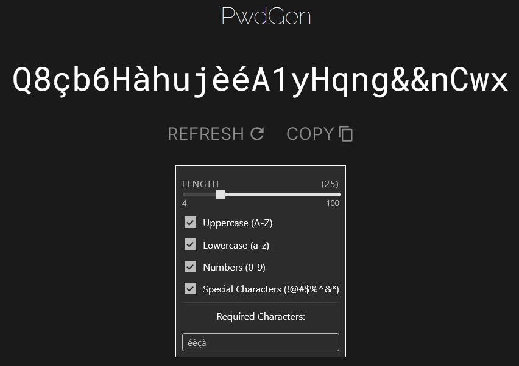

# 🔐 PwdGen — Simple Password Generator

PwdGen is a simple, browser-based password generator built entirely using [Cursor](https://www.cursor.so/). I didn’t write a single line of code by hand — it was all generated through AI-assisted development.

## 💡 Why did I make this

This project was a way for me to test how usable Cursor is for building small, functional web apps. The idea was straightforward — a password generator — and it made a great candidate to evaluate how much I could rely on AI for a complete project.

## 🧰 Tech Stack

- [Vue.js](https://vuejs.org/) (frontend only)
- No backend
- Fully built using Cursor

## ⚙️ Run Locally

```batch
git clone https://github.com/Exorion1er/PwdGen.git
cd PwdGen
npm install
npm run dev
```
Then open the local server URL (usually http://localhost:5173) in your browser.

## 📸 Screenshot



## 📜 License

MIT — use, remix, and share freely.
